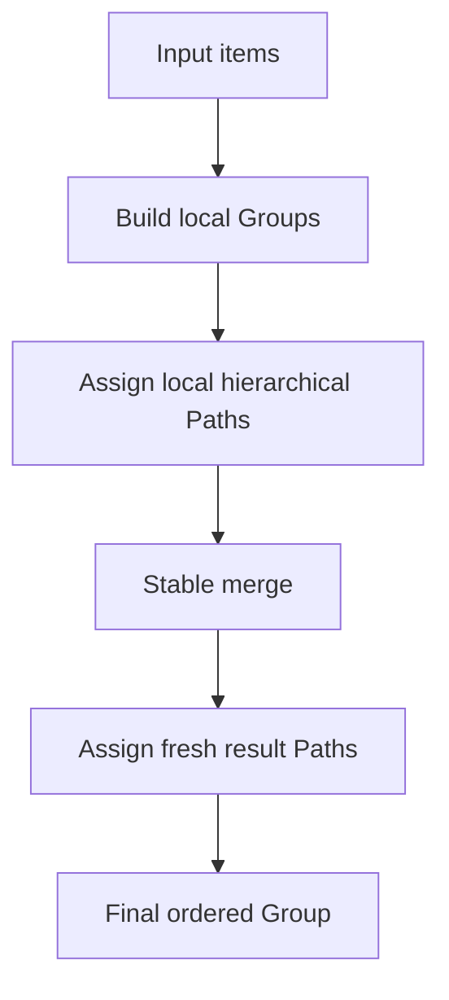

# LayerKeySort

*A C17 library for mutable ordering with hierarchical Path coordinates.*

`LksOrderedTree` keeps borrowed items in comparator order and assigns their
Paths. `LksTree` lets an application choose Paths itself for explicit moves.
Both support exact-Path removal; neither owns the item objects. A Path is a
changeable ordering coordinate, not an item ID. Immutable Groups and a stable
pointer-array sort cover batch use.

**Latest stable:** `v2.0.0`. **Latest V3 prerelease:**
`v3.0.0-rc.1`. Preview.1 through Preview.5 preceded this public Release
Candidate. Stable `v2.0.0` remains recommended for normal use.

> [!WARNING]
> **V2 is stable as of v2.0.0.** It retains RC.1's production behavior and includes observation regression tests. Exact automatically generated Path layouts and performance remain implementation details.
>
> Passing tests confirms the tested correctness properties. It does not establish final optimization, complexity, heuristic tuning, or production readiness.

**V3 RC.1 is a published prerelease, not a stable release.**
Normal users should pin stable `v2.0.0`. See the
[V2 to V3 migration guide](docs/V3_MIGRATION.md) before adopting the
development API.

## Quick start

From the repository root, build and run the
[ordered-tree example](examples/ordered_tree.c):

```sh
cmake -S . -B build -DLKS_BUILD_TESTS=OFF
cmake --build build --target layerkeysort_ordered_example
./build/layerkeysort_ordered_example
```

With a multi-configuration generator such as Visual Studio, run
`build/Debug/layerkeysort_ordered_example.exe` after building Debug. The
example creates a Tree, inserts three caller-owned items, locates one,
removes it, and destroys the Tree. Expected output:

```text
Found: Middle
After removal: Low < 20 < High
```

For one-time stable array sorting, use the smaller
[sort example](examples/basic.c). For explicit coordinates and moves, use the
[layer-list example](examples/layer_list.c). To link the library from another
project, follow [integration](docs/INTEGRATION.md); only
`#include "layerkeysort.h"` is needed by application code.

## Release history

| Version | Main purpose | Still provisional or deferred |
| --- | --- | --- |
| v2.0.0-preview.1 | Establish the V2 baseline: re-encodable Paths, sparse bulk Group/Batch construction, `lks_sort`, CMake/CI, and production diagnostic isolation. | Local congestion handling, online insertion policy, heuristic tuning, and final performance. |
| v2.0.0-preview.2 (released) | Add bounded local Tree relabel/rebuild before accepting a deeper Path or using the full-Tree fallback. | Window and depth heuristics, equal-run lookup performance, allocator tuning, long-term Tree/Path design, and complexity analysis. |
| v2.0.0-preview.3 (released) | Use the full 16-bit slot range and a compact Path text codec while keeping the V2 ordering model. | Equal-run lookup, child storage, topology coupling, and heuristic tuning remain open. |
| v2.0.0-preview.4 (released) | Add a Path-keyed AVL Tree, remove/rekey, canonical display parsing, LK1 sortable keys, and measured endpoint insertion improvements. | Preview semantics and generated Paths remain provisional; full rebuild has adversarial costs, and some insertion workloads regress. |
| v2.0.0-preview.5 (released) | Improve real-use examples, integration guidance, long-run mutation testing, platform coverage, and public-contract review. | Still a Preview; core complexity and persistence limits remain. |
| v2.0.0-rc.1 (released candidate) | Freeze and validate the V2 public contract and documented source integration. | Historical prerelease; production implementation retained for stable 2.0.0. |
| v2.0.0 (stable) | Activate the 2.x compatibility contract and retain RC observation regression coverage. | Full rebuild cost, formal insertion bounds, and optional integrations remain open. |
| v3.0.0-preview.1 (released Preview) | Separate manual and managed Tree ordering; replace managed physical full rebuild with adaptive logical coordinate relabeling. | Experimental API, provisional relabel policy, no formal amortized insertion bound. |
| v3.0.0-preview.2 (released experimental Preview) | Carry endpoint coordinates into available ancestor slots and adapt stride during long endpoint runs; add focused soak and diagnostic evidence. | Interior relabel cost and complete insertion complexity remain unbounded by AVL height alone. |
| v3.0.0-preview.3 (released experimental Preview) | Stabilize comparator/borrow contracts, correct V3 complexity documentation, and add comparable hotspot and footprint diagnostics. | Full-range relabel and Path growth remain workload dependent; no formal complete-insertion bound. |
| v3.0.0-preview.4 (released experimental Preview) | Make the V3 entry path, examples, integration, and performance limits easier to verify. | The V3 algorithm and its large-relabel costs are unchanged. |
| v3.0.0-preview.5 (released experimental Preview) | Audit the V3 public and release contracts, and validate supported consumer/build paths for RC consideration. | Full-range relabel and Path/storage growth remain workload-dependent; no formal complete-insertion bound. |
| v3.0.0-rc.1 (published Release Candidate) | Freeze the V3 feature set, strengthen negative-contract coverage, and validate the implementation for final stabilization. | Possible full-range relabel, workload-dependent storage and tail latency, and no formal complete-insertion bound. |

Stable v2.0.0 retains RC.1's Path-keyed Tree, remove/rekey, canonical
display parsing, LK1 sortable keys, and production algorithm. Observation tests
add consumer persistence and adversarial input coverage. See the
[compatibility contract](docs/COMPATIBILITY.md).

**[Open the live interactive visualizer](https://rxy712200.github.io/LayerKeySort/)**


The visual shows a **historical v1** Path showcase. The local browser visualizer in [`docs/demo/`](docs/demo/) does not execute the production C implementation and its recorded Path values do not describe the V2 allocator.

## Visual overview



Paths in separate Groups are local positions. A merge leaves both inputs unchanged and assigns a fresh coordinate layout to the result; exact Base Paths may change.

## Why LayerKeySort?

- Stable ordering for items that compare equal.
- Hierarchical Path positions that can represent deeper levels and gaps.
- A one-call stable pointer-array sort for ordinary use.
- Explicit Group and GroupBatch construction and merge operations.
- Base-first ordering for equal items from a public two-Group merge.
- A C17 public API that borrows caller-owned item pointers.

## Choosing the right API

### When to use it

Use `LksOrderedTree` when items have a consistent comparator and the library
should manage their order. Equal items retain insertion order. To change a
sort key, remove the item by its Path, update it, and reinsert it; changing
comparison fields while resident breaks the ordering assumption.

Use `LksTree` when the application chooses coordinates, such as inserting a
layer between two others or moving one with `lks_tree_rekey()`. Keep stable
application IDs separate from Paths. The [layer-list example](examples/layer_list.c)
shows this model. `LK1:` can persist one sortable coordinate, not an entire
Tree or item identity.

### When not to use it

- For one-time array sorting, an ordinary sorting routine may be simpler.
  `lks_sort()` is available when a stable pointer-array sort is useful, but
  dynamic Path machinery is unnecessary.
- If only occasional database reorder operations need a compact lexical rank
  string, a simpler fractional-ranking scheme may have lower conceptual and
  storage overhead.
- The current mutable Path model does not provide distributed/CRDT replica
  convergence or immutable permanent rank or item-identity values.
- Complete comparator-driven insertion has no claimed worst-case `O(log n)`
  bound or formal amortized bound. Choose a different design if a proven
  operation bound is required.
- Managed insertion can relabel many existing Paths at once. In the documented
  [one-machine Preview.3 validation](docs/BENCHMARKS.md), 1,000,000 alternating
  inserts took about 44 seconds and had individual pauses over 700 ms. Avoid synchronous
  latency-sensitive use at that scale without measuring your workload.

## Core idea

A Path is an ordering coordinate, **not a permanent item ID**. `000` is the ZERO Path, distinct from the Tree's virtual root. Since V2 Preview.3, Paths have all 65,536 numeric slots (`0..65535`); each formats as three radix-54 characters from the current ASCII alphabet. Positive Paths begin with `0`, negative Paths with `1`; `/` separates steps, and optional decimal metadata records a nonzero first level or a later level jump. A parent sorts before its descendants. Use `lks_path_compare()` for ordering: complete formatted Path strings are not a general lexicographic sort key. The exact alphabet, comparison rules, and formatter grammar are specified in the [API reference](docs/API.md).

For example, an additional position can be inserted between a parent and an existing descendant by using a deeper skipped level:

```text
A         0DEq
Inserted  0DEq/5222
X         0DEq/2222
B         0DEr
```

The Path comparison and gap APIs implement this ordering. Tree mutations may re-encode Paths; reacquire borrowed Tree nodes and Paths after an actual mutation. Canonical display text can be parsed, and a coordinate can be persisted as a separate `LK1:` order key. For example, display `0222` has key `LK1:201FF0000!`. A persisted coordinate is not a permanent item identity. The historical **V2** Preview.3 did not contain the parser or LK1 APIs.

## Ordering and stability guarantees

- A comparator result below zero places the left item first; zero means equal under that comparator; above zero places it after the right item.
- Comparator-equal items retain their input/source order. In a public two-Group merge, equal Base items precede equal Incoming items; Batch merging preserves chunk order.
- Group and Batch merge inputs must have ordering semantics compatible with the supplied merge comparator and context.
- Item pointers are borrowed. LayerKeySort does not clone or free caller-owned items; callers manage their lifetime.

## Public API overview

The public header is [`include/layerkeysort.h`](include/layerkeysort.h).

- **Path:** create, clone, append, format/parse display text, format/parse durable keys, compare, and find positions before, after, or between other Paths.
- **Simple sort:** `lks_sort()` stable-sorts the caller's pointer array.
- **Manual Tree:** insert, find, remove, and rekey explicit Path coordinates.
- **Ordered Tree (V3 development):** bind a comparator at creation, insert and
  locate items in stable comparator order, remove by exact Path, and read nodes.
- **Group:** build a sorted Group and access its items and Paths.
- **GroupBatch / merge:** build Groups from consecutive input chunks and merge Groups or a Batch.
- **Status / comparator:** report operation status and supply a comparison callback with caller-owned context.

## Build

For the reusable library and test suite:

```sh
cmake -S . -B build
cmake --build build
ctest --test-dir build --output-on-failure
```

The existing `LayerKeySort.slnx` / `.vcxproj` remain available for MSVC C17
validation. Build artifacts belong in an out-of-source `build/` directory.
For consuming this library from another CMake project, see
[integration](docs/INTEGRATION.md).

## Validation

The repository includes deterministic property tests, stress tests, a Preview.5 mutation soak, allocation-failure and out-of-memory tests, and a public API smoke test. CI is configured for Windows/MSVC, Ubuntu/GCC and Clang (including sanitizer validation), and macOS/AppleClang. A passing runner does not guarantee every platform version. Path heuristics are internal and may change; no optimal complexity claim is made.

## Performance evidence

The [benchmark report](docs/BENCHMARKS.md) includes stable V2 and V3
development measurements, including regressions and memory tradeoffs. The
[benchmark harness](benchmarks/README.md) is optional in CMake. V3 managed
insertion keeps physical AVL nodes during a full-range coordinate relabel,
but the relabel can still touch every item. Complete insertion has no claimed
worst-case `O(log n)` or formal amortized bound.

## Current limitations

- Shared mutable objects are not guaranteed to be thread-safe; use external synchronization when sharing them.
- Paths from separate Groups are local coordinates until a merge establishes the result's path space.
- Published Groups are immutable; their borrowed Paths stay stable until Group destruction. After an actual Tree mutation, reacquire all borrowed Tree nodes, Paths, and navigation results. Equal-Path rekey is a no-op and preserves them.
- Manual Tree removal does not compact Paths; manual rekey changes the selected item's coordinate. The V3 ordered container does not expose arbitrary rekey.
- No binary serialization protocol, fixed memory ceiling, or public allocator/fault-injection API is provided. The `LK1:` key requires bytewise ASCII database collation for ordering.
- The `LK1:` key persists one Path coordinate; it does not save a Tree or caller items, assign permanent item IDs, or provide distributed/CRDT conflict resolution. Package-manager recipes and a public custom allocator are optional future integrations.

## Project layout

```text
include/layerkeysort.h
src/
examples/basic.c
examples/ordered_tree.c
examples/layer_list.c
tests/
demo/main.c
LayerKeySort.slnx
LayerKeySort.vcxproj
LICENSE
CHANGELOG.md
```

## Documentation

- [Usage guide](docs/USAGE.md)
- [Integration guide](docs/INTEGRATION.md)
- [2.x compatibility contract](docs/COMPATIBILITY.md)
- [V3 migration guide](docs/V3_MIGRATION.md)
- [API reference](docs/API.md)
- [Development guide](docs/DEVELOPMENT.md)
- [Benchmark report](docs/BENCHMARKS.md)
- [Contributing](CONTRIBUTING.md)
- [Interactive visualizer source](docs/demo/index.html)

## License

LayerKeySort is licensed under the [MIT License](LICENSE).
