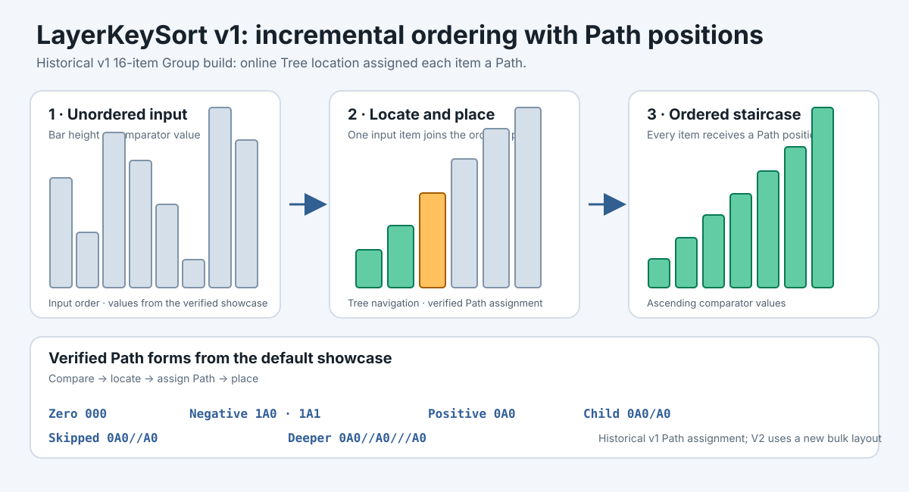
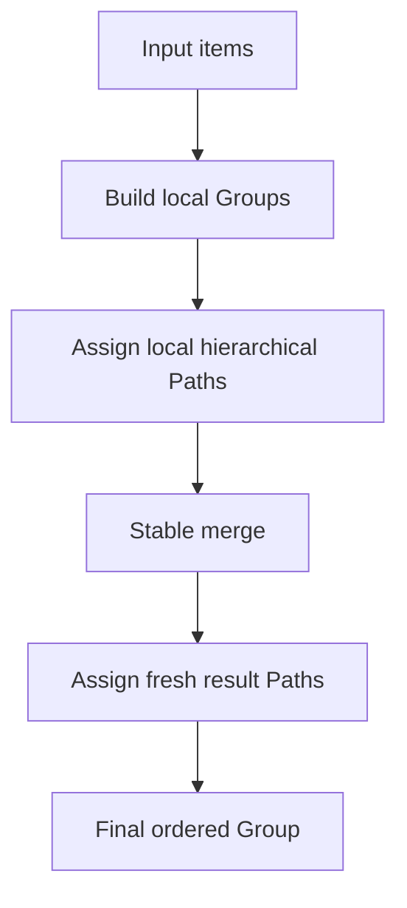

# LayerKeySort

*A stable C17 ordering library based on hierarchical path keys. v2.0.0-preview.1.*

LayerKeySort orders caller-owned item pointers with a comparator and gives each item an explicit Path position. Groups can be built independently and merged while preserving the order of comparator-equal items. The public API is C17 and models paths, trees, groups, and batches directly.

**[Open the live interactive visualizer](https://rxy712200.github.io/LayerKeySort/)**



The visual shows a **historical v1** Path showcase. The local browser visualizer in [`docs/demo/`](docs/demo/) does not execute the production C implementation and its recorded Path values do not describe the V2 allocator.

## Visual overview



Paths in separate Groups are local positions. A merge leaves both inputs unchanged and assigns a fresh coordinate layout to the result; exact Base Paths may change.

## Why LayerKeySort?

- Stable ordering for items that compare equal.
- Hierarchical Path positions that can represent deeper levels and gaps.
- A one-call stable pointer-array sort for ordinary use.
- Explicit Group and GroupBatch construction and merge operations.
- Base-first ordering for equal items from a public two-Group merge.
- A C17 public API that borrows caller-owned item pointers.

## Core idea

A Path is an ordering position, not an application key. `000` is the zero Path code and is distinct from the Tree's virtual root. Positive paths begin with `0`, while negative paths begin with `1`. Each step uses a slot from `A0` through `Z9`. A slash introduces a deeper step, and repeated slashes represent skipped levels. A parent position sorts before its descendants.

For example, an additional position can be inserted between a parent and an existing descendant by using a deeper skipped level:

```text
A         0A3
Inserted  0A3//A0
X         0A3/A0
B         0A4
```

The Path comparison and gap APIs implement this ordering.

## Quick start

Include the public header and stable-sort a pointer array in one call.
The pointed-to objects remain caller-owned; equal keys keep input order.

```c
#include "layerkeysort.h"

/* compare_items has signature: int (const void *, const void *, void *) */
LksStatus status = lks_sort(items, item_count, compare_items, NULL);
if (status != LKS_STATUS_OK) {
    /* Handle allocation or argument failure. */
}
```

The complete compilable example is [`examples/basic.c`](examples/basic.c).
For inspectable Path coordinates and explicit Group merging, see the
[usage guide](docs/USAGE.md).

## Ordering and stability guarantees

- A comparator result below zero places the left item first; zero means equal under that comparator; above zero places it after the right item.
- Comparator-equal items retain their input/source order. In a public two-Group merge, equal Base items precede equal Incoming items; Batch merging preserves chunk order.
- Item pointers are borrowed. LayerKeySort does not clone or free caller-owned items; callers manage their lifetime.

## Public API overview

The public header is [`include/layerkeysort.h`](include/layerkeysort.h).

- **Path:** create, clone, append, format, compare, and find positions before, after, or between other Paths.
- **Simple sort:** `lks_sort()` stable-sorts the caller's pointer array.
- **Tree:** insert items or explicit Paths, locate entries, and navigate nodes.
- **Group:** build a sorted Group and access its items and Paths.
- **GroupBatch / merge:** build Groups from consecutive input chunks and merge Groups or a Batch.
- **Status / comparator:** report operation status and supply a comparison callback with caller-owned context.

## Build

For the reusable library and test suite:

```sh
cmake -S . -B build
cmake --build build
ctest --test-dir build --output-on-failure
```

The existing `LayerKeySort.slnx` / `.vcxproj` remain available for MSVC C17 validation. Build artifacts belong in an out-of-source `build/` directory.

## Validation

The repository includes deterministic property tests, stress tests, allocation-failure and out-of-memory tests, and a public API smoke test. CI checks MSVC, GCC, and Clang. Preview Path heuristics are provisional and may change before v2.0.0; no optimal complexity claim is made.

## Current limitations

- Shared mutable objects are not guaranteed to be thread-safe; use external synchronization when sharing them.
- Paths from separate Groups are local coordinates until a merge establishes the result's path space.
- Published Groups are immutable; their borrowed Paths stay stable until Group destruction. Successful Tree mutation may re-encode and invalidate borrowed Tree node/Path views.
- Serialization, a Path text parser, a fixed memory ceiling, and a public allocator or fault-injection API are not provided.

## Project layout

```text
include/layerkeysort.h
src/
examples/basic.c
tests/
demo/main.c
LayerKeySort.slnx
LayerKeySort.vcxproj
LICENSE
CHANGELOG.md
```

## Documentation

- [Usage guide](docs/USAGE.md)
- [API reference](docs/API.md)
- [Development guide](docs/DEVELOPMENT.md)
- [Contributing](CONTRIBUTING.md)
- [Interactive visualizer source](docs/demo/index.html)

## License

LayerKeySort is licensed under the [MIT License](LICENSE).
