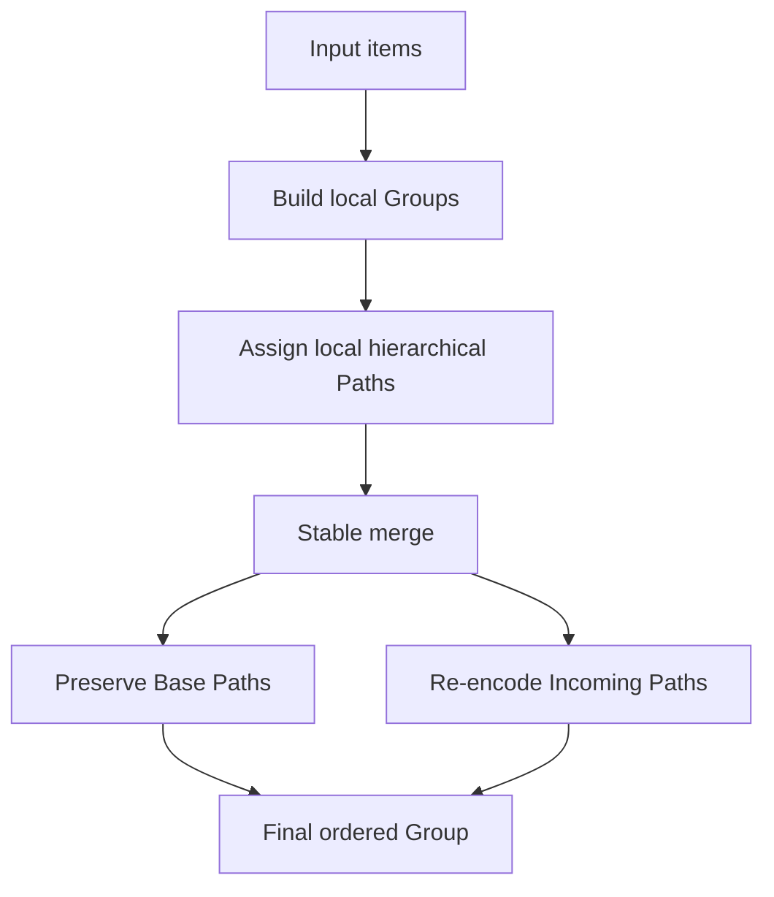

# LayerKeySort

*A stable C17 ordering library based on hierarchical path keys.*

LayerKeySort orders caller-owned item pointers with a comparator and gives each item an explicit Path position. Groups can be built independently and merged while preserving the order of comparator-equal items. The public API is C17 and models paths, trees, groups, and batches directly.

## Visual overview



Paths in separate Groups are local positions. During a merge, Base positions are retained and Incoming positions are encoded in the result's path space.

## Why LayerKeySort?

- Stable ordering for items that compare equal.
- Hierarchical Path positions that can represent deeper levels and gaps.
- Explicit Group and GroupBatch construction and merge operations.
- Base-first ordering for equal items from a public two-Group merge.
- A C17 public API that borrows caller-owned item pointers.

## Core idea

A Path is an ordering position, not an application key. `000` is the zero Path code and is distinct from the Tree's virtual root. Positive paths begin with `0`, while negative paths begin with `1`. Each step uses a slot from `A0` through `Z9`. A slash introduces a deeper step, and repeated slashes represent skipped levels. A parent position sorts before its descendants.

For example, an additional position can be inserted between a parent and an existing descendant by using a deeper skipped level:

```text
A         0A3
Inserted  0A3//A0
X         0A3/A0
B         0A4
```

The Path comparison and gap APIs implement this ordering.

## Quick start

This example builds local Groups from chunks, merges them, and reads the ordered items by index. The complete example, including output and cleanup details, is in [`examples/basic.c`](examples/basic.c).

```c
#include "layerkeysort.h"

typedef struct Item {
    int key;
    int source_order;
} Item;

static int compare_item_key(const void *left, const void *right, void *context)
{
    const Item *a = (const Item *)left;
    const Item *b = (const Item *)right;
    (void)context;
    if (a->key < b->key) return -1;
    if (a->key > b->key) return 1;
    return 0;
}

int main(void)
{
    Item items[] = { { 2, 0 }, { 1, 1 }, { 2, 2 }, { 1, 3 } };
    void *item_pointers[sizeof(items) / sizeof(items[0])];
    const size_t item_count = sizeof(items) / sizeof(items[0]);
    LksComparator comparator = { compare_item_key, NULL };
    LksGroupBatch *batch = NULL;
    LksGroup *result = NULL;
    size_t index;
    int previous_key = 0;
    LksStatus status;

    for (index = 0; index < item_count; ++index) {
        item_pointers[index] = &items[index];
    }

    status = lks_group_batch_build(item_pointers, item_count, 2,
        &comparator, &batch);
    if (status != LKS_STATUS_OK) return 1;

    status = lks_group_batch_merge_all(batch, &comparator, &result);
    if (status != LKS_STATUS_OK) {
        lks_group_batch_destroy(batch);
        return 1;
    }

    for (index = 0; index < lks_group_size(result); ++index) {
        const Item *item = (const Item *)lks_group_item_at(result, index);
        if (item == NULL || (index != 0 && item->key < previous_key)) {
            lks_group_destroy(result);
            lks_group_batch_destroy(batch);
            return 1;
        }
        previous_key = item->key;
    }

    lks_group_destroy(result);
    lks_group_batch_destroy(batch);
    return 0;
}
```

## Ordering and stability guarantees

- A comparator result below zero places the left item first; zero means equal under that comparator; above zero places it after the right item.
- Comparator-equal items retain their input/source order. In a public two-Group merge, equal Base items precede equal Incoming items; Batch merging preserves chunk order.
- Item pointers are borrowed. LayerKeySort does not clone or free caller-owned items; callers manage their lifetime.

## Public API overview

The public header is [`include/layerkeysort.h`](include/layerkeysort.h).

- **Path:** create, clone, append, format, compare, and find positions before, after, or between other Paths.
- **Tree:** insert items or explicit Paths, locate entries, and navigate nodes.
- **Group:** build a sorted Group and access its items and Paths.
- **GroupBatch / merge:** build Groups from consecutive input chunks and merge Groups or a Batch.
- **Status / comparator:** report operation status and supply a comparison callback with caller-owned context.

## Build

Open `LayerKeySort.slnx` or `LayerKeySort.vcxproj` in Microsoft Visual Studio. The project targets x64 and compiles `.c` files as C17 with MSVC. Existing configurations are **Debug**, **Release**, and **ASan** (AddressSanitizer).

## Validation

The repository includes deterministic property tests, stress tests, allocation-failure and out-of-memory tests, and a public API smoke test. The project has been validated with MSVC x64 Debug, Release, and AddressSanitizer configurations. GCC and Clang builds and 32-bit targets have not been validated.

## Current limitations

- Shared mutable objects are not guaranteed to be thread-safe; use external synchronization when sharing them.
- Paths from separate Groups are local coordinates until a merge establishes the result's path space.
- Serialization, a Path text parser, a fixed memory ceiling, and a public allocator or fault-injection API are not provided.

## Project layout

```text
include/layerkeysort.h
src/
examples/basic.c
tests/
demo/main.c
LayerKeySort.slnx
LayerKeySort.vcxproj
LICENSE
CHANGELOG.md
```

## License

LayerKeySort is licensed under the [MIT License](LICENSE).
