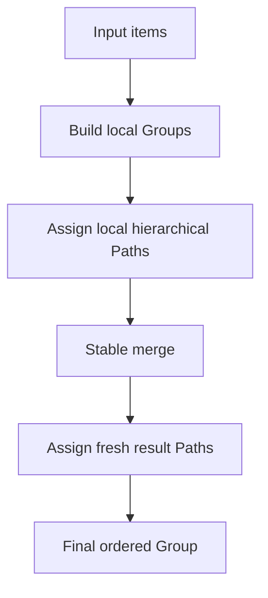

# LayerKeySort

*A C17 library for stable ordering with hierarchical Path positions. v2.0.0-preview.3 released Preview snapshot.*

LayerKeySort orders caller-owned item pointers with a comparator and gives each item an explicit Path position. Groups can be built independently and merged while preserving the order of comparator-equal items. The public API is C17 and models paths, trees, groups, and batches directly.

> [!WARNING]
> **V2 is currently in Preview.** Preview releases are public development snapshots, not production-ready releases. Each validates part of the V2 design; known or unknown defects and deliberately simple behavior may remain. Algorithms, heuristics, internal structures, exact generated Path layouts, and performance may change.
>
> Passing tests confirms the tested correctness properties. It does not establish final optimization, complexity, heuristic tuning, or production readiness.

## Quick start

```c
#include "layerkeysort.h"

lks_sort(items, count, compare_items, NULL);
```

`items` is a caller-owned pointer array; `compare_items` defines the order. Sorting is stable, and the pointed-to objects remain caller-owned. `lks_sort` returns `LksStatus`, which production code should check. See the complete, compilable example with error handling in [`examples/basic.c`](examples/basic.c). For Path, Tree, and Group operations, see the [usage guide](docs/USAGE.md).

## V2 development status

| Version | Main purpose | Still provisional or deferred |
| --- | --- | --- |
| v2.0.0-preview.1 | Establish the V2 baseline: re-encodable Paths, sparse bulk Group/Batch construction, `lks_sort`, CMake/CI, and production diagnostic isolation. | Local congestion handling, online insertion policy, heuristic tuning, and final performance. |
| v2.0.0-preview.2 (released) | Add bounded local Tree relabel/rebuild before accepting a deeper Path or using the full-Tree fallback. | Window and depth heuristics, equal-run lookup performance, allocator tuning, long-term Tree/Path design, and complexity analysis. |
| v2.0.0-preview.3 (released) | Use the full 16-bit slot range and a compact Path text codec while keeping the V2 ordering model. | Equal-run lookup, child storage, topology coupling, and heuristic tuning remain open. |

Unreleased V2 stabilization work on the development branch decouples mutable
Tree indexing from Path prefixes and adds Path-addressed Tree removal and
rekey, strict display parsing, and versioned sortable Path keys. The released Preview.3 tag remains unchanged;
the development branch is not a production release.

**[Open the live interactive visualizer](https://rxy712200.github.io/LayerKeySort/)**


The visual shows a **historical v1** Path showcase. The local browser visualizer in [`docs/demo/`](docs/demo/) does not execute the production C implementation and its recorded Path values do not describe the V2 allocator.

## Visual overview



Paths in separate Groups are local positions. A merge leaves both inputs unchanged and assigns a fresh coordinate layout to the result; exact Base Paths may change.

## Why LayerKeySort?

- Stable ordering for items that compare equal.
- Hierarchical Path positions that can represent deeper levels and gaps.
- A one-call stable pointer-array sort for ordinary use.
- Explicit Group and GroupBatch construction and merge operations.
- Base-first ordering for equal items from a public two-Group merge.
- A C17 public API that borrows caller-owned item pointers.

## Core idea

A Path is an ordering coordinate, **not a permanent item ID**. `000` is the ZERO Path, distinct from the Tree's virtual root. Preview.3 offers all 65,536 numeric slots (`0..65535`); each formats as three radix-54 characters from the current ASCII alphabet. Positive Paths begin with `0`, negative Paths with `1`; `/` separates steps, and optional decimal metadata records a nonzero first level or a later level jump. A parent sorts before its descendants. Use `lks_path_compare()` for ordering: complete formatted Path strings are not a general lexicographic sort key. The exact alphabet, comparison rules, and formatter grammar are specified in the [API reference](docs/API.md).

For example, an additional position can be inserted between a parent and an existing descendant by using a deeper skipped level:

```text
A         0DEq
Inserted  0DEq/5222
X         0DEq/2222
B         0DEr
```

The Path comparison and gap APIs implement this ordering. Tree mutations may re-encode Paths; reacquire borrowed Tree nodes and Paths after an actual mutation. The unreleased branch can parse canonical display text and persist a coordinate as a separate `LK1:` order key. For example, display `0222` has key `LK1:201FF0000!`. A persisted coordinate is not a permanent item identity. Preview.3 is a released Preview snapshot and does not contain these new APIs.

## Ordering and stability guarantees

- A comparator result below zero places the left item first; zero means equal under that comparator; above zero places it after the right item.
- Comparator-equal items retain their input/source order. In a public two-Group merge, equal Base items precede equal Incoming items; Batch merging preserves chunk order.
- Group and Batch merge inputs must have ordering semantics compatible with the supplied merge comparator and context.
- Item pointers are borrowed. LayerKeySort does not clone or free caller-owned items; callers manage their lifetime.

## Public API overview

The public header is [`include/layerkeysort.h`](include/layerkeysort.h).

- **Path:** create, clone, append, format/parse display text, format/parse durable keys, compare, and find positions before, after, or between other Paths.
- **Simple sort:** `lks_sort()` stable-sorts the caller's pointer array.
- **Tree:** insert, remove by Path, rekey an item's Path, locate entries, and navigate nodes.
- **Group:** build a sorted Group and access its items and Paths.
- **GroupBatch / merge:** build Groups from consecutive input chunks and merge Groups or a Batch.
- **Status / comparator:** report operation status and supply a comparison callback with caller-owned context.

## Build

For the reusable library and test suite:

```sh
cmake -S . -B build
cmake --build build
ctest --test-dir build --output-on-failure
```

The existing `LayerKeySort.slnx` / `.vcxproj` remain available for MSVC C17 validation. Build artifacts belong in an out-of-source `build/` directory.

## Validation

The repository includes deterministic property tests, stress tests, allocation-failure and out-of-memory tests, and a public API smoke test. CI is configured to check MSVC, GCC, and Clang when this branch is pushed. Preview Path heuristics are provisional and may change before v2.0.0; no optimal complexity claim is made.

## Current limitations

- Shared mutable objects are not guaranteed to be thread-safe; use external synchronization when sharing them.
- Paths from separate Groups are local coordinates until a merge establishes the result's path space.
- Published Groups are immutable; their borrowed Paths stay stable until Group destruction. After an actual Tree mutation, reacquire all borrowed Tree nodes, Paths, and navigation results. Equal-Path rekey is a no-op and preserves them.
- Unreleased Tree remove does not compact Paths; rekey changes the selected item's coordinate. AVL rotations change physical links, not Path encodings. Caller-selected rekeys must preserve comparator order before later comparator-driven operations.
- No binary serialization protocol, fixed memory ceiling, or public allocator/fault-injection API is provided. The unreleased `LK1:` key requires bytewise ASCII database collation for ordering.

## Project layout

```text
include/layerkeysort.h
src/
examples/basic.c
tests/
demo/main.c
LayerKeySort.slnx
LayerKeySort.vcxproj
LICENSE
CHANGELOG.md
```

## Documentation

- [Usage guide](docs/USAGE.md)
- [API reference](docs/API.md)
- [Development guide](docs/DEVELOPMENT.md)
- [Contributing](CONTRIBUTING.md)
- [Interactive visualizer source](docs/demo/index.html)

## License

LayerKeySort is licensed under the [MIT License](LICENSE).
