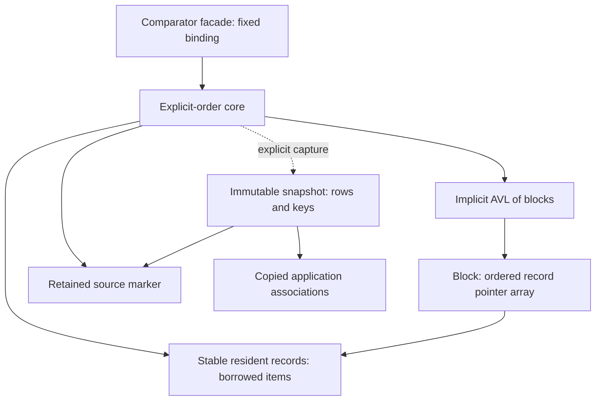

# V4 architecture definition

> Imported by content from commit `3c0373f4bd62287766a84e79e9ee5dbc03194e38`
> onto production baseline `c33afa2ac08248bffa6dde51bd590a5d799b394a`.
> No research commits were merged or cherry-picked. The Stage 3 status and
> evidence below are historical; current implementation scope is documented in
> [V4 Preview.1](../V4_PREVIEW1.md).

Status: **Stage 3 selected architecture; not an implemented or released V4 API.**
Starting commit: `cbf1862c63fa4e23bef4f1383df7e2b464051ae0`.
Production remains v3.1.0. Exact C names, layouts and new wire bytes are not frozen.
The [decision record](V4_DECISIONS.md) separates evidence, design decisions,
assumptions and unresolved implementation work.

## 1. Selection and evidence boundary

V4 has one contextual explicit-order core, a comparator-managed facade over that
core, and independent immutable snapshot exports. Resident records have no
standalone sortable Path. An implicit AVL index orders bounded blocks; each
block contains an ordered array of pointers to stable resident records.

This selects Phase 2 outcome **D — Hybrid required**. It is not an S/I dual-engine
system. S remains an experimental reference. No prototype ABI, snapshot token or
allocator is adopted as production code by this document.

Sources reviewed: current public header; Tree/OrderedTree, Path/LK1, Group/Batch,
sort and allocator implementations; ownership/API docs;
[V3 migration](../V3_MIGRATION.md), [compatibility](../COMPATIBILITY.md),
[architecture](../ARCHITECTURE.md), [design history](../history/DESIGN_HISTORY.md);
[Phase 1](https://github.com/RXY712200/LayerKeySort/blob/3c0373f4bd62287766a84e79e9ee5dbc03194e38/docs/research/V4_ROOT_CAUSE_PHASE1.md) and
[Phase 2](https://github.com/RXY712200/LayerKeySort/blob/3c0373f4bd62287766a84e79e9ee5dbc03194e38/docs/research/V4_ARCHITECTURE_PHASE2.md); actual
[F attempt](https://github.com/RXY712200/LayerKeySort/blob/3c0373f4bd62287766a84e79e9ee5dbc03194e38/research/architecture/flat_attempt.py),
[I/S implementations](https://github.com/RXY712200/LayerKeySort/blob/3c0373f4bd62287766a84e79e9ee5dbc03194e38/research/architecture/models.c),
[declarations](https://github.com/RXY712200/LayerKeySort/blob/3c0373f4bd62287766a84e79e9ee5dbc03194e38/research/architecture/models.h),
[semantic traces/oracle](https://github.com/RXY712200/LayerKeySort/blob/3c0373f4bd62287766a84e79e9ee5dbc03194e38/research/architecture/campaign.py),
[replay adapter](https://github.com/RXY712200/LayerKeySort/blob/3c0373f4bd62287766a84e79e9ee5dbc03194e38/research/architecture/replay.c) and their tests.

Phase 1 located mixed cost in coordinate preparation, rejected repair work,
validation and cleanup. Phase 2 tested contextual order against an independent
flat oracle across 25 scenarios and 162 replays. I/S had smaller observed tails
and requested resident payload on demanding timelines; exports and recurring
local writes remain real costs. These are single-environment experiments,
not a proof or V4 performance promise.

Evidence erratum: the captured large timeline has **five relabel operations,
four full-range operations**, not five full-range operations. See the decision
record. Archived reports/captures are unchanged.

## 2. Entities and ownership

| Entity | Ownership / lifetime | Mutability and address | Public observation / invalidation |
|---|---|---|---|
| Explicit-order core | Caller owns container; core owns records, blocks, index and marker reference | Mutable; address stable until destroy | Opaque owned object, not struct-copyable; destroy ends all residences |
| Comparator facade | Caller owns facade; it exclusively owns its core and copied comparator descriptor | Fixed binding | No mutable underlying-core escape |
| Application item | Caller owns payload; records borrow pointers | Caller controls lifetime/data | Kept alive while resident or otherwise borrowed; library never frees it |
| Resident record | Core owns one allocation per residence | Stable address; owner/block/local index maintained privately | Opaque handle refers to it; remove destroys it |
| Item handle | Non-owning opaque record pointer | Stable during residence | Copyable; removal/destroy expires every copy |
| Block | Core owns array plus embedded index node | Mutable; address stable until merge/deletion | Never publicly exposed/copied |
| Block-index node | Embedded in block | Mutable links/height/subtree block count | Physical shape private |
| Local position | Private record array index | Changes on local maintenance | Not public durable rank/identity |
| Core revision | Core-owned unsigned 64-bit counter | Incremented once per actual public mutation | Meaningful only with the same live source identity |
| Source marker | Separate immutable allocation retained by core/snapshots | Stable until last reference released | Internal identity, not serialized application ID |
| Iterator | Caller-owned cursor borrowing live core | Captures revision/traversal state | Actual mutation expires cursor; no-op/failure preserves it |
| Snapshot | Caller owns completed object, buffers and marker reference | Immutable | Survives source mutation/destruction; destroy ends borrowed row/key views |
| Snapshot row | Snapshot owns ordinal and copied association bytes | Immutable stable buffers | Borrowed read-only views; callers can copy bytes |
| Export key | Snapshot owns bytes; caller can retain copies | Immutable | Comparable within export domain; never live position input |
| Group | Caller owns immutable flat array, borrows items | Order fixed | Item views borrowed; no live handles/Paths |
| GroupBatch | Caller owns builder/chunks, borrows items | Accumulating builder | Chunk order defines equality precedence; chunks are not live blocks |

Initial V4 retains a private allocation layer, no public custom allocator.
Aligned allocations either succeed or fail; sizes are checked first. Fault
injection remains private. Deallocation is non-failing and never invokes item
destructors. No unspecified caller allocator context is borrowed. A later
allocator proposal needs its own context/deallocation/synchronization contract.



## 3. Fundamental committed-state invariant

Let the AVL in-order block sequence be `b0 ... b(M-1)`. Each block contains
`r0 ... r(k-1)`. Global residence order is their concatenation. Every record
occurs exactly once; its owner, block and local index agree with that occurrence.
No committed block is empty. Parent links, AVL heights, subtree block counts,
threaded predecessor/successor links, cached endpoints and resident count agree.

For two live records in one core:

1. Same block: compare local indices.
2. Different blocks: compare block ranks computed from parent links and subtree
   block counts. Ranks are contextual computed values, never published labels.

This defines an antisymmetric, transitive total residence order. Distinct
comparator-equal records have distinct positions. A record equals itself.
Cross-container comparison is a domain error, not a global order.

Split replaces one subsequence with two adjacent subsequences whose concatenation
is identical. Merge concatenates neighbors; redistribution repartitions that
same concatenation. Move removes one occurrence and inserts it at its requested
neighbor position. AVL rotations preserve in-order blocks. No public whole-block
relocation exists. No public state exposes a half-split or half-move.

```text
Private AVL in-order:    block A          block B          block C
Local arrays:           [r0,r1,r2]       [r3,r4]          [r5,r6]
Global order:           r0 < r1 < r2 < r3 < r4 < r5 < r6
Stable handles:         point to records, not array slots or block ranks
```

## 4. Local blocks and top-level ordering

### Occupancy policy

Initial policy: even `B = 128`, `H = B/2`, B at least eight. B is internal,
fixed per core lifetime, tunable later and not a wire/API ordering constant.
Each block has an embedded AVL node, threaded neighbors and contiguous storage
for **B+1 record pointers**. The extra slot is commit scratch, not steady capacity.
Records themselves never move in memory.

Committed occupancy:

- Empty core: no blocks.
- Single block: 1..B entries.
- Multiple blocks: every block H..B entries.

Insert into a full block prepares one spare block, then splits B+1 entries into
floor/ceil halves (64/65 at B128). At most one split; no split cascade.

Deletion leaving H-1 entries selects the immediate right neighbor, otherwise
left. If combined count fits B, concatenate into the left block and retire the
right. Otherwise divide the concatenation approximately in half between the
same blocks. Existing arrays suffice: removal, merge and redistribution allocate
nothing. A sole empty block is retired.

Proof of repair termination: neighbor occupancy is H..B, so pair total is
`2H-1 .. B+H-1`. A merge fits B and retains at least H. When total exceeds B,
both redistribution halves are H..B. Only one source can underflow after removing
one record, so no further repair chain arises. This **selected design rule is
stronger than the I prototype's tested optional merge policy**; implementation
tests must prove it rather than inherit prototype results.

Insertion/deletion shift pointers and repair indices in O(B). Same-block move
shifts an interval of at most B entries, preserving occupancy. Pair repair is
O(B). No coordinate-depth growth is involved.

### Implicit block AVL

Keep AVL balancing on blocks, with height and subtree **block** count. No
per-resident rank array, materialized block labels, subtree item count or public
rank/select is required. Block insertion/removal updates O(log M) ancestors.
Known-handle placement resolves the block directly. Threaded neighbors and
cached first/last blocks provide O(1) logical neighbor steps and O(N) traversal.
Export therefore need not repeat the I prototype's block-rank lookup per row.

This reuses a tested balancing mechanism without reopening an index contest.
Contiguous pointer arrays offer local access, but separate records/headers still
cost indirection and allocator overhead. No unmeasured cache improvement is claimed.

## 5. Handle and borrowed-lifetime rules

Handle identity survives other insertions/removals, same/cross-block moves,
split/merge/redistribution and rotations. It expires on its own removal or core
destruction. Removal optionally returns the borrowed item and frees the record,
never the item. Reinsertion is a new residence even at a reused memory address.

**Dangling handle detection is not promised.** Never pass a freed handle to an
API. An owner field rejects a still-live foreign handle; it cannot safely
validate a pointer to freed storage. Handles cannot be serialized, numerically
ordered or used as business IDs. Identity equality is allowed only for live
handles. The same item pointer may reside twice with distinct handles.

There is no borrowed live coordinate. Item getters borrow the caller's payload.
First/last/next/previous return logical live handles. Saving the next handle
before removing current is valid if that next residence itself stays alive.

Iterators borrow the core and capture its revision. Any actual mutation expires
them even though handles survive. Check revision **before dereferencing cached
record/block state**. Failed operations and successful no-ops preserve validity.
An iterator cannot outlive the core; no revision check validates a destroyed core.

Revision starts at zero, increments once per actual public mutation, never per
rotation/split, and never wraps. At UINT64_MAX reject a would-be mutation before
commit. Queries, snapshots, no-ops and destruction remain possible. Explicitly
rebuilding a new core creates new handles/marker. This capacity error prevents
old cursors/snapshots becoming current through counter reuse.

## 6. Conceptual operations and comparator composition

Names below describe semantics, not frozen C declarations.

| Operation | Contract |
|---|---|
| Insert front/back | New residence at endpoint; either works for empty core |
| Insert before/after | Live same-core anchor required; never a snapshot key |
| Remove | Exact handle, optional returned item; no allocation; other handles survive |
| Move before/after | Live same-core moved/anchor handles; identity and count preserved |
| Move front/back | Endpoint movement; no cross-container transfer |
| Move no-op | Self-anchor/already requested adjacency/endpoint succeeds without revision change |
| First/last | Empty result for empty core; no physical root exposure |
| Next/previous | Logical neighbor; endpoint has empty result |
| Compare | Residence order in one core, not comparator equality/historical order |
| Iterate | Revision-checked traversal |
| Size | Constant-time resident count |
| Destroy | End residence lifetimes; free core storage, never caller items |

Same-block move changes only its array. Cross-block move prepares one spare
block if destination is full **before unlinking**. Commit removes from source,
inserts relative to the still-live destination handle, splits if necessary,
then repairs source underflow using **post-insertion neighbors**. Never use
cached anchor ordinals after removal/maintenance. A source block may be empty
internally while commit is private.

Source repair can involve a newly split destination block. Update final record
locations for affected arrays; do not assume original block assignments survive.
At most one destination split and one source pair repair touch at most four
distinct block arrays. Retired blocks are freed only after records/links are
committed. No distance scan or deferred work queue exists.

### Comparator-managed facade

One facade exclusively owns a private core. Copy comparator descriptor; borrow
callback/context for its lifetime. Binding is fixed. Expose ordered insertion,
lookup, logical iteration, handle removal and snapshots; no arbitrary order
moves or mutable underlying-core escape.

Lookup for the first comparator-equal residence instead searches the first block
whose maximum is greater than or equal to the query, then uses local lower bound
and verifies equality. A missing result is explicit; it never fabricates a live
handle from an exported key. Neighbor/bound queries use these contextual searches.

Comparator defines a consistent total preorder. Its semantics/context and
comparator-visible resident data stay stable. To change a key: remove, change,
reinsert, as separate operations, not an atomic payload transaction. Handle
removal needs no comparator call, but ordered queries/inserts on an inconsistent
collection have no correctness promise. No automatic scan detects changed data.

Stable equality uses upper bound. Search block maxima for the first block whose
maximum is strictly greater than query; binary upper-bound search within that
block, otherwise append. Equal-only blocks are skipped by balanced search,
not successor scanning. Target comparator calls O(log M + log B), multiplied
by callback cost. Group/Batch source equality precedence remains unchanged.

## 7. Immutable snapshots and export domains

Snapshot captures a particular logical sequence, source revision, flat ordinal
0..N-1 and optional caller-supplied per-occurrence associations. It owns all
rows/bytes; no live handles, blocks, item pointers or former-core pointer are
retained. Keys encode snapshot ordinal, never live block rank/local position.
Thus order is independent of capacity, splits and index shape.

Optional association callback receives borrowed item and ordinal, returns a
byte span copied immediately. Never retain caller pointers. Duplicate business
IDs are allowed; ordinal distinguishes occurrences. Persistence users should
provide occurrence IDs where one object resides twice. Without associations,
snapshot captures order alone, insufficient to restore payload mapping.

Allocate a checked row array/key pool and geometrically grown or chunked copied
association storage; traverse once, no rank queries or Path generation. Target
O(N+A+callback work), O(N+A) storage, A total association bytes. Avoid quadratic
buffer concatenation and an unnecessary second N-item traversal array.
OOM/overflow/callback failure cleans preparation, output NULL, core unchanged.

Caller serializes capture against mutations and relevant payload changes.
Per-core operation guards reject same-core callback reentry, including reads.
Comparator/association callbacks return normally; no throw through C or longjmp
escape. No callback observes structural commit.

### Historical validity versus currentness

Core owns a reference to a separately allocated immutable source marker;
snapshots retain it independently. Destroyed core releases its reference without
destroying snapshots. Marker address cannot be reused while a snapshot retains
it, so a new core at a recycled address never falsely matches old snapshots.

Currentness query accepts an explicitly live core and compares marker identity
and revision. Snapshot never dereferences a former-core pointer. Rows remain
readable after arbitrary mutations, item destruction and core destruction.
Serialized snapshots keep historical meaning, not restart-valid currentness.

Currentness means **order revision**, not current application payload/association
values. Manual-core payload edits and external ID changes are not tracked by the
library. A captured association stays historical; callers must version their own
payload/identity data and use a fresh export namespace when that state changes.

Marker retention/release must be overflow-safe and atomic across independently
destroyed objects. This is lifetime bookkeeping, not operation locking. Portable
C17/MSVC backend and tests remain implementation work, not an existing capability.

An immutable Group can also be a capture source: it owns a marker, uses fixed
revision zero, and exports its flat sequence through the same association/domain
rules. Its destruction releases that marker reference; completed snapshots still
survive. Batch builders are not capture sources until an immutable result exists.
Snapshot retention does not retain the Group's borrowed item pointers.

### New key family: semantic requirements, not final byte grammar

Introduce a new versioned snapshot-order family; do **not** reuse LK1/AI1/AS1.
Wire specification and golden vectors are later Preview gates. Requirements:

- Deterministic canonical printable ASCII, explicit family/version.
- Copied caller-supplied export namespace identifying one immutable snapshot
  state. External uniqueness is caller responsibility, no implicit globally
  unique random-ID guarantee.
- Order-preserving ordinal field; unsigned 64-bit is the selected domain.
  Counts/lengths must also fit destination SIZE_MAX, otherwise reject, never truncate.
- Within same version/namespace, strcmp order equals row order; database
  collation must preserve ASCII bytes.
- Same logical order, associations and namespace yield same keys independent
  of topology. Empty snapshot has no row keys.
- Validate version/domain, overflow and canonicality. Incompatible changes
  require new version.

Export domain is `(format version, export namespace)`. Never use one namespace
for different snapshot states; reuse only for an identical immutable state,
including associations. Local code cannot establish global namespace uniqueness.
In-memory source marker/revision is provenance, not persisted namespace.

Semantic cross-domain key comparison is rejected. Raw strcmp can order bytes
but gives **no residence-order meaning** across domains. The same business item
in two snapshots has no cross-snapshot precedence guarantee. Copied keys remain
sortable within their original domain; historical keys are not live move inputs.

Completed snapshots can be streamed to storage. Capture must finish before
publication, not incremental. Streaming failure may leave partial external writes;
library cannot undo I/O. Use temporary files/storage transactions for atomic save.
Incremental/delta export is outside initial scope.

## 8. Persistence and V3 migration

Persist manifest (family/version, namespace, row count), canonical ordered keys,
copied occurrence associations and independently versioned caller payload data.
Source revision is historical metadata, not restart-valid identity.

Load validates syntax, one domain, checked sizes/counts and unique complete
ordinal sequence. Resolve application associations to borrowed items, then build
fresh half-full-or-better blocks and balanced index. Already ordered input costs
O(N+A) excluding resolver work; unsorted input adds O(N log N) key comparisons.
Missing/duplicate ordinals or inconsistent manifest counts fail.

Prepare all result storage; publish only after full validation. Failure exposes
no partial core. Caller resolver side effects are not rolled back; caller-created
items must be released by caller on failed load. Library never frees payloads.

Load preserves **logical order**, not handles, topology, revisions or process
currentness. Retain original snapshot artifact for exact historical keys.
Fresh core exports normally use new namespace/keys. No continuously maintained
live coordinate strings are required between snapshots.

V3 migration uses unchanged published LK1 codec in an isolated migration
tool/companion. Strictly decode, reject unsupported/noncanonical/overflowing
values, sort bytewise, verify Path uniqueness when restoring former Tree data,
resolve associations, bulk-build V4 sequence. Distinct old Paths may contain
the same item pointer as separate occurrences. Never strcmp-sort display text.
V4 core receives ordered items and has no V3 Path internals dependency.

## 9. Prepare/commit failure atomicity

| Operation | Preparation | Allocation-free commit |
|---|---|---|
| Insert | Validate anchor/count/revision/arithmetic; allocate record and block for empty/full destination | Shift/link, optional split, index/count updates, one revision increment; publish handle |
| Delete | Validate live handle and revision capacity; no allocation | Remove, one neighbor repair, index/count updates; retire record/block; return item |
| Same-block move | Validate and detect no-op | Interval shift/index repair, one revision increment |
| Cross-block move | Validate/no-op; prepare spare destination block if full | Remove/insert, one split/source repair, final locations/index, one revision increment |
| Split | Spare block prepared by parent operation | Partition B+1 pointers; insert adjacent block/index node |
| Merge/redistribute | Existing arrays suffice | Preserve concatenation, update locations/links/index; retire right block after unlink |
| AVL change | Existing/prepared embedded node; overflow checked | Rotations, ancestor counts/heights/thread links |
| Snapshot | Validate lengths/domain; allocate/copy; safely retain marker | Publish complete result; no live mutation |
| Bulk load/Group build/merge | Prepare and validate entire independent result | Publish; sources untouched |

Failure before commit leaves order, record locations/addresses, handles, revision,
iterators, snapshots and borrowed payload associations unchanged. Clean unpublished
preparation; initialize outputs empty before fallible work. Once commit starts,
no allocation, comparator, association callback or I/O can run. Non-failing
deallocation occurs after references are consistent; allocator latency is not
bounded. Cross-move OOM leaves the record at its original position/handle.
Remove/change payload/reinsert is not a generalized atomic transaction.

## 10. V3 concept disposition

| V3 concept | Disposition | Reason / migration |
|---|---|---|
| LksPath | Remove from primary V4 core API | Contextual residence replaces standalone hierarchy; Path users may stay on V3 |
| LK1 | Remove from V4 core; preserve published V2/V3 codec and migration contract | Never reinterpret version1 as snapshot-domain bytes |
| LksTree | Replace | Relative-position core; no arbitrary Path insertion/rekey |
| LksOrderedTree | Preserve purpose, redefine as facade | One private core, fixed binding, stable equality |
| LksTreeNode | Replace | Stable resident handle; physical topology hidden |
| Group | Preserve semantics, redefine storage | Immutable flat borrowed-item array, no Path/index generation |
| GroupBatch | Preserve semantics, redefine storage | Stable source-chunk equality; chunks not live blocks |
| Comparator binding | Preserve substantially | Copied descriptor, borrowed stable callback/context/data |
| Physical AVL indexing | Preserve mechanism, redefine unit | Contextually ordered blocks, no Path keys |
| Public child/root navigation | Remove | Logical neighbors useful; physical shape constrains evolution |
| Managed insertion | Replace | Upper-bound search plus bounded blocks, no coordinate repair |
| Rekey | Remove, replace movement meaning | Handle-relative move is not arbitrary coordinate replacement |
| Serialization | Replace | Explicit snapshot domain and logical-order restore |
| lks_sort | Preserve stable convenience semantics | No algorithm redesign needed |

Group stable-sorts a copied item array; merge builds a fresh array, source Groups
unchanged, equal Base before Incoming. Batch preserves earlier source-chunk
precedence. Retire Group Path access; keep conceptual count/item access and
explicit snapshots. No Group resident handles.
Caller items must remain alive for all Group/Batch use; immutable order does not
make borrowed payload immutable or library-owned. Merge comparators require
source arrays to remain compatible with the supplied ordering semantics.

Major-version source break is intentional. Hierarchical coordinate users stay
on V3 or use an application map, not a shim secretly rebuilding Paths. Ordered
users migrate borrowed node/Path workflows to handles; Group users migrate
Path access to explicit export. New names are not frozen here.

## 11. Threading and callbacks

No internal mutable-core operation locks. Caller serializes same-core operations
whenever mutation or capture is involved; no reads concurrent with mutation.
Multiple quiescent-core reads allowed if comparator/payload access is safe.
Separate cores independent subject to shared caller item/context synchronization.

Snapshots own immutable buffers, safe for concurrent reads with secured lifetime.
Destroy/read races are caller errors. Atomic marker reference bookkeeping solely
protects hidden shared lifetime; it does not make operations thread-safe. Private
global fault injection/diagnostics require serialized tests.

Callback reentry guards are not mutexes or permission for unsynchronized calls.
Caller synchronizes comparator, identity/payload serialization and any separately
proposed allocator context. Callbacks cannot escape controlled C execution.

## 12. Complexity and storage targets

N residents, M blocks, B capacity, A association bytes. With H=B/2 occupancy,
nonempty `M <= max(1, 2N/B)`. Bounds below are selected structural targets,
**not guarantees of an existing V4 implementation**.
Logarithmic notation includes constant work at M=0/1: use log(1+M).
Resident counts must fit both SIZE_MAX and UINT64_MAX; reject capacity overflow
before insertion/load. Check all array products, pool sums and terminators.

| Operation | Target | Allocations / work scope |
|---|---|---|
| Known-position insert | O(B + log M) | Record, optional one block; local arrays/index paths |
| Remove | O(B + log M) | No allocation; one source repair |
| Same-block move | O(B) | No allocation/index change |
| Cross-block move | O(B + log M) | Optional spare block; at most four distinct arrays |
| Managed insert/lookup | O(log M + log B) comparator calls, plus insertion work | Callback cost separate; no equality-run length factor |
| Compare handles | O(1) same block; O(log M) otherwise | Computed ranks, no allocation |
| Endpoints/neighbors/size | O(1) | Cached endpoints/thread links |
| Iterate | O(N) | Revision-checked cursor |
| Snapshot | O(N+A) plus callback work | O(N+A) explicit result; no per-row rank search |
| Ordered bulk load | O(N+A) plus resolver work | Explicit whole-result preparation |
| Group build/merge | O(N log N) / O(N), plus comparator work | Explicit result allocation |
| Destroy | O(N+M) plus deallocation | Explicit full cleanup |

Normal mutation must not rewrite an unbounded number of unrelated residents.
Logarithmic index metadata updates are allowed; computed suffix ranks can change
without suffix record writes. No deferred maintenance/global relabel exists.
No realtime/wall-clock or formal whole-library amortized claim follows.

Resident ordering storage target:

`N*sizeof(record) + M*(sizeof(block header)+(B+1)*sizeof(pointer)) + O(1)`.

Owner/item pointers and threaded links make the design larger than the I research
minimum; measured ~36 bytes/item is not a V4 promise. Measure allocator overhead,
fragmentation/RSS, split peaks and retained snapshots. Churn releases removed
records/blocks; no historical handle registry or growing live coordinate depth.
Historical memory grows only through deliberately retained snapshots.

## 13. Preview acceptance gates

Before adoption require:

1. Independent flat-oracle differential tests, all Phase2 families, equality,
   owner/revision/no-op tests and drain to empty.
2. AVL/thread/occupancy/location invariants every randomized step; cross-move
   where destination split changes source repair neighbor.
3. Counters enforcing one split/one source repair, bounded affected arrays,
   logarithmic ancestor work, no full rewrite/debt. Derive field-write bound
   from actual implementation, not prototype's loose envelope.
4. Every insert/split/move/snapshot/load failpoint and failing association
   callback; state/revision unchanged, empty output, no leaks; available sanitizers.
5. Long churn/grow-shrink RSS/allocator evidence: metadata bounded by current N
   and B, no tombstone/high-water registry growth.
6. Ascending/descending/random/equal/duplicates/alternating/hotspot, timeline,
   priority/local/distant drag and churn, multiple scales; one-million endpoint
   inserts where feasible. V3 reference, not every-percentile-improvement mandate.
7. Separate mutation/query/export/cleanup allocation and work; count recurring
   local reindexing rather than describe it as free.
8. Identical traces exporting every 100/1000/10000 operations; retained snapshots,
   source destruction; total application cost and key/association storage.
9. Wire grammar/golden vectors, malformed/overflow/domain tests, byte-collation
   docs, cross-platform decoding and save/destroy/load occurrence equality.
10. Supported compilers/consumers, marker lifetime concurrency and callback
    reentry tests before any claim beyond the specified threading contract.

No microsecond threshold is frozen. Material allocator/export-heavy regression
requires evidence-based implementation/policy review or honest suitability limits
before Stable, never hidden cost in a mutation-only chart.

## 14. Thirteen stress walkthroughs

These are design arguments, not newly measured V4 runs.

| Scenario | Invariant and work paid |
|---|---|
| Tiny-gap repeated insert | Neighbor resolves contextual position; bounded shifts/split; no shrinking numeric gap |
| 1,000,000 ascending inserts | Last block append/split; O(B+log M); allocate records/blocks, no whole-order refresh |
| All-equal managed insert | Upper bound skips equal block maxima and appends after equals; bounded insertion |
| Alternating adversarial insert | Endpoint/neighbor direct resolution; local split/repair, no encoding/debt |
| Repeated local drag | Interval shift or bounded cross-move; handles stable, iterators expire on actual move |
| Repeated long-distance move | Handles resolve endpoints without distance scan; one split/repair, logarithmic index |
| Deletion churn | One merge/redistribution restores occupancy; free removed storage, no dead-handle registry |
| Cross-move under OOM | Spare preparation fails before unlink; location/handle/revision/cursor unchanged |
| Split under OOM | Record/spare preparation fails; no committed overcapacity/partial handle |
| Snapshot then many mutations | Owned rows/keys/marker survive; revision changes currentness, never old bytes |
| Two historical snapshots | Each domain/association immutable; cross-domain order rejected; no silently current keys |
| Save/destroy/load | Manifest+ordinals+occurrences restore order, fresh layout/handles/marker; old snapshot still historical |
| V3 LK1 migration | Strict legacy decode/byte-sort establishes logical sequence; fresh V4 build, no byte reinterpretation |

## 15. Non-goals and unresolved implementation work

Non-goals: CRDT/replica ordering, database engine, owning business identity/payloads,
scene framework, operation locking, restart-persistent handles, generalized
transactions, incremental export, public rank/select, cross-container moves,
automatic freed-pointer validation. Explicit O(N) capture is a real tradeoff.

Open work: exact C signatures/statuses; packing/allocator overhead; checked
revision/ordinal/count handling; AVL detach/thread links; write-envelope derivation
and cross-move cases; portable atomic marker retention; namespace width/wire
grammar; association storage/load API; migration packaging/platform evidence.
These are implementation gates, not competing primary architectures.

Context-free live keys, zero-cost exports and fail-safe dangling-handle validation
are not promises. Applications requiring them may prefer V3 or a separately
justified future proposal.

**Stage 3: PASS for architecture definition.** No V4 release or implementation
approval is implied; the stronger block policy still needs implementation tests.
